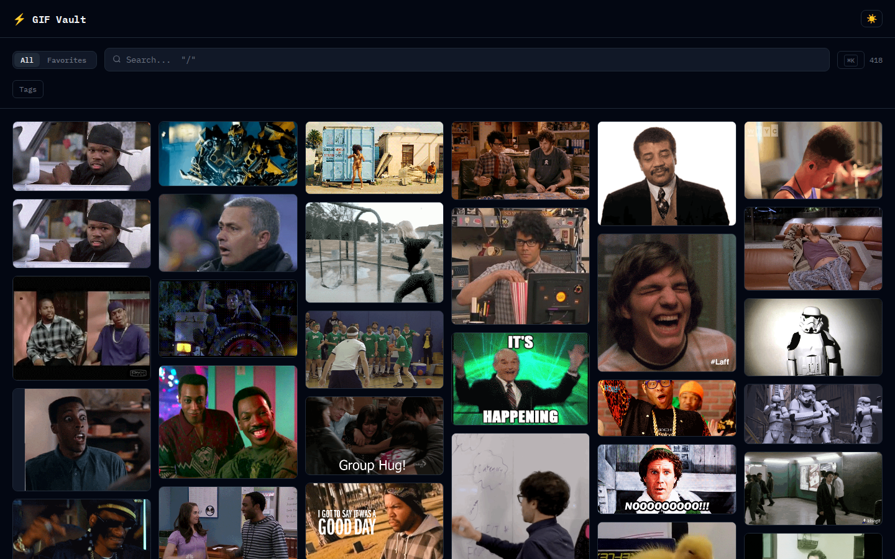
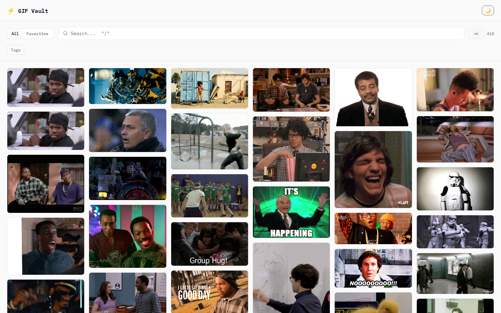
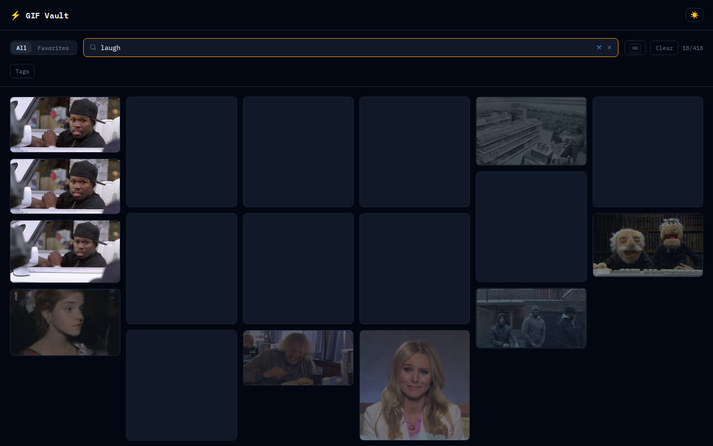
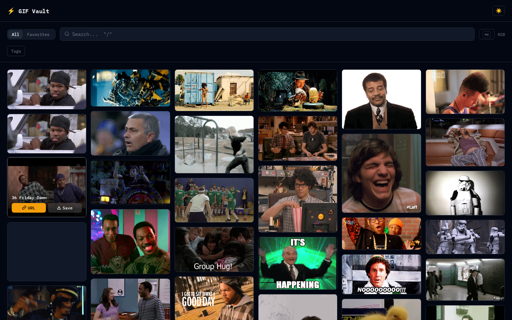
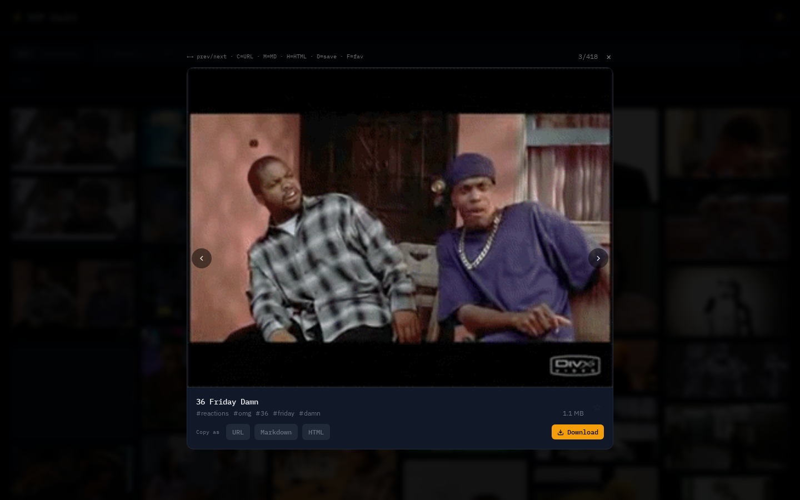
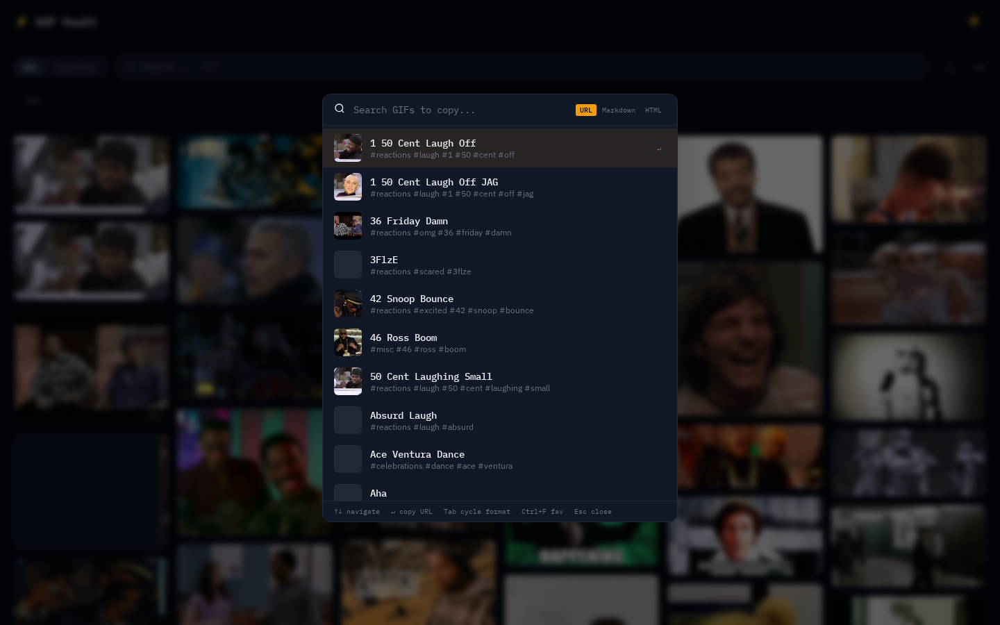

# GIF Vault

A static, searchable GIF library. Fork it, add your GIFs, push, and get your own gallery on GitHub Pages.

No backend, no framework, no build tools beyond 11ty.



## Quick Start

### Use this template

1. **Fork** this repo
2. **Edit** `_data/site.json` with your title and colors
3. **Add GIFs** to `gifs/` folders (subfolders = categories)
4. **Push** to main — GitHub Actions deploys automatically

### Local development

```bash
nvm use        # Node 22+
npm install
npm run dev    # builds index + starts dev server on :8080
```

## Screenshots

| Dark | Light |
|------|-------|
|  |  |

| Search | Hover Actions |
|--------|---------------|
|  |  |

| Lightbox | Command Palette |
|----------|-----------------|
|  |  |

## Folder Structure

```
gifs/
  reactions/
    laugh/          # subcategory
      my-gif.gif
    facepalm/
  celebrations/
    dance/
  misc/             # uncategorized
```

Folders define categories and tags automatically. No config needed.

## Custom Metadata (optional)

Drop a `_meta.yaml` in any folder to override titles or add extra tags:

```yaml
my-gif:
  title: "Custom Title"
  tags: ["extra-tag", "another"]
```

## Customization

Edit `_data/site.json`:

```json
{
  "title": "My GIF Stash",
  "description": "Personal reaction GIF collection",
  "baseUrl": "/your-repo-name",
  "theme": {
    "accent": "#f59e0b",
    "bg": "#030712",
    "surface": "#111827"
  }
}
```

## Features

- Search by name, tag, or keyword
- Filter by category tags (collapsible)
- Favorites (localStorage)
- Lightbox with prev/next navigation
- Command palette (Cmd+K)
- Copy as URL, Markdown, or HTML
- Download GIFs
- Dark/light theme
- Responsive masonry layout

## Keyboard Shortcuts

| Key | Context | Action |
|-----|---------|--------|
| `/` | Anywhere | Focus search |
| `Cmd+K` | Anywhere | Open command palette |
| `Escape` | Search / Lightbox / Palette | Close / blur |
| `Enter` / `Space` | Card focused | Open preview |
| `C` | Card / Lightbox | Copy URL |
| `M` | Lightbox | Copy as Markdown |
| `H` | Lightbox | Copy as HTML |
| `D` | Card / Lightbox | Download GIF |
| `F` | Card / Lightbox | Toggle favorite |
| `Arrow Left/Right` | Lightbox | Previous / next GIF |
| `Arrow Up/Down` | Command palette | Navigate results |
| `Tab` | Command palette | Cycle copy format |

## Scripts

| Script | Description |
|--------|-------------|
| `npm run dev` | Build index + start dev server with live reload |
| `npm run build` | Build index + static site to `_site/` |
| `npm run index` | Rebuild GIF index only |
| `npm run screenshots` | Generate screenshots (requires dev server running) |

## Deployment

Deploys automatically via GitHub Actions on push to `main`.

- `.github/workflows/deploy.yml` — single workflow: build + deploy to Pages
- Output: `_site/` directory

### Manual deploy

```bash
npm run build
# Upload _site/ to any static host
```

## Tech Stack

- [11ty](https://www.11ty.dev/) v3 — static site generator
- Vanilla JS web components — zero framework dependencies
- Plain CSS with custom properties — no build step for styles

## License

[MIT](LICENSE)
